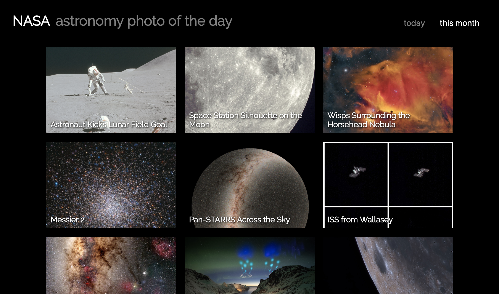
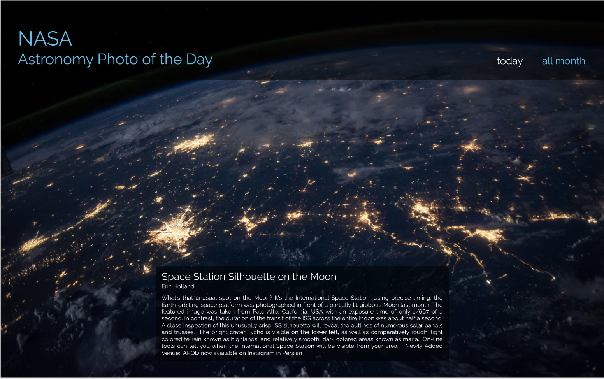

# NASA Astronomy Photo of the Day
#### This app displays beautiful astronomy photos for the current day and month from the [NASA APOD API](https://api.nasa.gov/api.html#apod). [SEE IT LIVE](https://nasa-apod-ohman.herokuapp.com/)

### Set-Up
- Get a NASA API key here: https://api.nasa.gov/index.html#apply-for-an-api-key
- Add your unique api key and an environment variable in an .env.development file
- Clone this repo: ```git clone https://github.com/kaohman/bike-see.git```
- Run ```npm install``` from root directory
- Run ```npm run serve``` and visit localhost:8080 in your browser

### Deployed Website
https://nasa-apod-ohman.herokuapp.com/

#### Background/About
This was my first time creating a Vue app. Users can view today's astronomy photo from NASA along with details about the photo and past photos for the month. The app uses responsive design to be both mobile and desktop friendly. The goal of the project was a practice take home code challenge using a new framework (Vue). View original assigment [here](https://gist.github.com/letakeane/28d852307097695c5d50b15857cb28eb).

#### Screenshots
##### Home page:


##### All month page:


### Primary Technologies Used
- Vue
- HTML
- CSS
- NASA API

#### Enhancements
- Include functionality to view older photos
- Incorporate Vue Router to dynamically change the URL path and allow users to share a specific photo
- Add Vuex for state management

### Contributors
[Karin Ohman](https://github.com/kaohman)

### Wireframes

